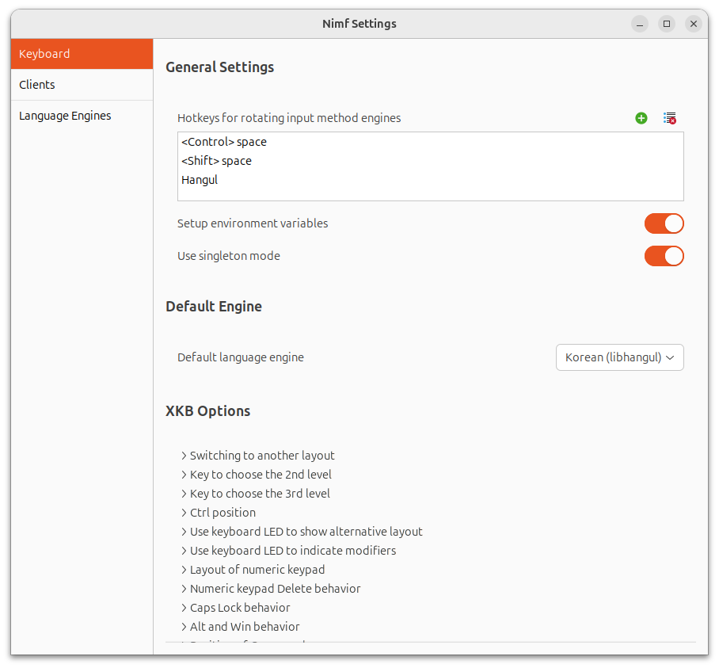

[English](#nimf) | [한국어](#가볍고-빠른-입력기-프레임워크-nimf)

# nimf

[한국어 바로가기](#가볍고-빠른-입력기-프레임워크-nimf)

Nimf is a lightweight, fast and extensible input method framework.

Nimf provides:
  * Input Method Server:
    * nimf
  * Language Engines:
    * System keyboard
    * Chinese (based on librime)
    * Japanese (based on anthy)
    * Korean (based on libhangul)
    * Various languages (based on m17n)
  * Service Modules:
    * Indicator (based on appindicator)
    * Wayland
    * NIM (Nimf Input Method)
    * XIM (based on IMdkit)
    * Preedit window
    * Candidate
  * Client Modules:
    * GTK+2, GTK+3, Qt5
  * Settings tool to configure the Nimf:
    * nimf-settings
  * Development files:
    * C library, headers and documents

# Install

* Ubuntu (>= 20.04)
```
# The ibus-daemon start automatically at Ubuntu 21.10.
# Input method conflict
# You can remove the ibus or disable ibus-daemon from booting
# Sol1 : sudo apt purge ibus
# Sol2 : sudo mv /usr/bin/ibus-daemon /usr/bin/ibus/ibus-daemon.bak

sudo rm -f /etc/apt/sources.list.d/hamonikr.list

curl -sL https://pkg.hamonikr.org/add-hamonikr.apt | sudo -E bash -

sudo apt install nimf nimf-libhangul

# If you want to use other languages(Japanese, Chinese, etc.)
sudo apt install libnimf1 nimf nimf-anthy nimf-dev nimf-libhangul nimf-m17n nimf-rime

im-config -n nimf
```

* Ubuntu (18.04), Debian 10
```
curl -sL https://apt.hamonikr.org/setup_hamonikr.sun | sudo -E bash -

sudo apt install nimf nimf-libhangul

# If you want to use other languages(Japanese, Chinese, etc.)
sudo apt install libnimf1 nimf nimf-anthy nimf-dev nimf-libhangul nimf-m17n nimf-rime

im-config -n nimf
```

* Manjaro : https://github.com/hamonikr/nimf/wiki/Manjaro-build

* CentOS 8 : https://blog.naver.com/dfnk5516/222074913406

* Raspberry pi 4 arm64 : https://github.com/hamonikr/nimf/wiki/Install-nimf-on-raspberry-pi-4---arm64

* Armbian : https://github.com/hamonikr/nimf/wiki/Armbian-build

* Manjaro ARM : https://github.com/hamonikr/nimf/wiki/Manjaro-build

* Arch AUR : https://aur.archlinux.org/packages/nimf-git/

* Others : https://github.com/hamonikr/nimf/wiki/How-to-Build-and-Install-with-Others-Distro

<hr>

# 가볍고 빠른 입력기 프레임워크 nimf

[Go to English](#nimf)

이 프로젝트는 한글입력기 nimf 가 더이상 [지속되기 힘든 상황](https://launchpad.net/~hodong/+archive/ubuntu/nimf) 이 되었기 때문에
프로젝트의 지속적인 사용을 위해서는 관리가 필요하다고 생각되어 [nimf Project](https://gitlab.com/nimf-i18n/nimf) 를 포크한 프로젝트 입니다.
다년간 한글 사용자를 위한 환경 개선에 많은 기여를 하신 Hodong Kim 님께 감사를 드립니다. 

하모니카 개발팀은 개방형OS 배포에 필수적인 한글입력기에 대한 관리가 필요하다고 생각하고 있으며
앞으로 하모니카 팀에서 직접 nimf 프로젝트를 계속 관리하기로 결정하였습니다.
향후 하모니카 팀에서 이 프로젝트에 필요한 기능을 계속 추가하여 좋은 소프트웨어를 사용할 수 있도록 노력하겠습니다.



# nimf 설치

## Ubuntu 21.04, Ubuntu 20.10, Ubuntu 20.04 , Linux Mint 20
```
# nimf 패키지 저장소가 변경되었습니다. 예전에 사용하던 하모니카 APT 설정이 있는 경우 삭제합니다. 
sudo rm -f /etc/apt/sources.list.d/hamonikr.list

curl -sL https://pkg.hamonikr.org/add-hamonikr.apt | sudo -E bash -

sudo apt install nimf nimf-libhangul

# 만약 일본어, 중국어 등 다른언어를 사용하고 싶은 경우에는 다음과 같이 추가 패키지를 설치해줍니다.
# Install additional packages as follows if you want to use other languages(Japanese, Chinese, etc.)
sudo apt install libnimf1 nimf nimf-anthy nimf-dev nimf-libhangul nimf-m17n nimf-rime

im-config -n nimf
```


## Debian 10, Ubuntu 18.04, 하모니카 1.4, 하모니카 3.0

1) apt 저장소 추가
```
curl -sL https://apt.hamonikr.org/setup_hamonikr.sun | sudo -E bash -
```
2) 입력기 nimf를 설치합니다.
```
sudo apt install nimf nimf-libhangul
```
만약 일본어, 중국어 등 다른언어를 사용하고 싶은경우에는 다음과 같이 추가 패키지를 설치해줍니다.
```
sudo apt install libnimf1 nimf nimf-anthy nimf-dev nimf-libhangul nimf-m17n nimf-rime
```
3) 기본 입력기를 nimf 로 설정
```
im-config -n nimf
```

## Manjaro
* https://github.com/hamonikr/nimf/wiki/Manjaro-build

## CentOS 8
* https://blog.naver.com/dfnk5516/222074913406

## Raspberry pi 4 arm64
* https://github.com/hamonikr/nimf/wiki/Install-nimf-on-raspberry-pi-4---arm64

## Armbian
* https://github.com/hamonikr/nimf/wiki/Armbian-build

## Manjaro ARM
* https://github.com/hamonikr/nimf/wiki/Manjaro-build

## Arch AUR
* https://aur.archlinux.org/packages/nimf-git/

## Others
* https://github.com/hamonikr/nimf/wiki/How-to-Build-and-Install-with-Others-Distro


# Build from Source
## git clone
프로그램 소스코드를 직접 다운로드 받는 경우 아래 경로에서 다운로드 가능합니다.
```
git clone https://github.com/hamonikr/nimf.git
```
## 또는 압축파일로 소스코드 다운로드
https://github.com/hamonikr/nimf/releases


## Build debian package 
* HamoniKR (>= 1.4), ubuntu 18.04, linuxmint (>= 19) 에서 테스트 되었습니다.
https://github.com/hamonikr/nimf/wiki/HamoniKR-build


# 라이선스
* GNU Lesser General Public License v3.0 ([한글 해석](https://olis.or.kr/license/Detailselect.do?lId=1073))
  
  Nimf is free software: you can redistribute it and/or modify it
  under the terms of the GNU Lesser General Public License as published
  by the Free Software Foundation, either version 3 of the License, or
  (at your option) any later version.

  Nimf is distributed in the hope that it will be useful, but
  WITHOUT ANY WARRANTY; without even the implied warranty of
  MERCHANTABILITY or FITNESS FOR A PARTICULAR PURPOSE.
  See the GNU Lesser General Public License for more details.

  You should have received a copy of the GNU Lesser General Public License
  along with this program;  If not, see <http://www.gnu.org/licenses/>.

# 이슈 발생 시
사용중 이슈는 깃헙 이슈를 이용하시거나 [하모니카 커뮤니티](https://hamonikr.org)를 방문해서 알려주시면 함께 고민하도록 하겠습니다.

# 소스코드 개선에 참여하는 법
깃헙 저장소를 포크하신 후 수정하실 내용을 수정하고 PR을 요청하시면 하모니카 팀에서 리뷰 후 대응합니다.
